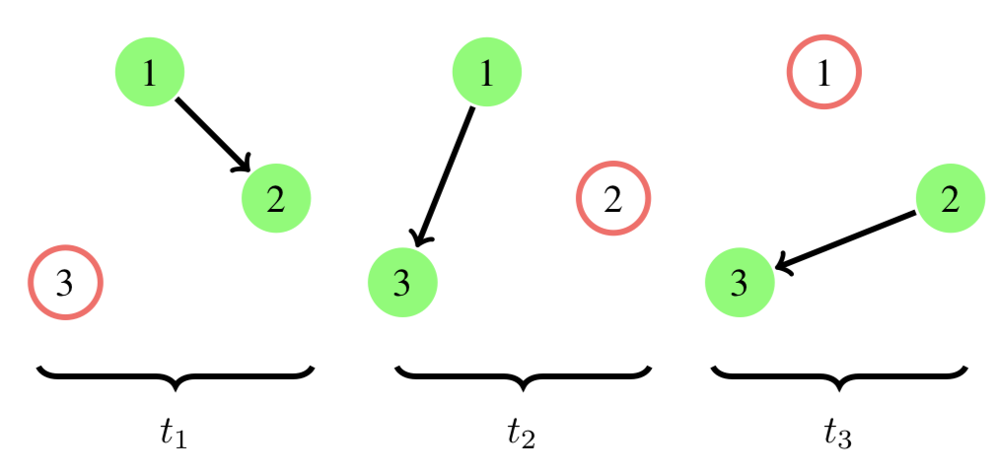

# EvolvingGraphs

[](https://travis-ci.org/EtymoIO/EvolvingGraphs.jl)
[](https://codecov.io/github/EtymoIO/EvolvingGraphs.jl?branch=master)

Studying networks that evolve over time.

* Installation:

```julia
Pkg.add("EvolvingGraphs")
```

* [Documentation](https://etymoio.github.io/EvolvingGraphs.jl/latest)

* [Release Notes](https://github.com/weijianzhang/EvolvingGraphs.jl/blob/master/NEWS.md)


## Get Started

We model a time-dependent network, a.k.a an evolving graph, as a ordered sequence of static graphs such that each static graph represents the interaction between nodes at a specific time stamp. The figure below shows an evolving graph with 3 timestamps.



Using `EvolvingGraphs`, we could simply construct this graph by using the function
`add_bunch_of_edges!`, which adds a list of edges all together.

```julia
julia> using EvolvingGraphs

julia> g = EvolvingGraph()
Directed EvolvingGraph 0 nodes, 0 static edges, 0 timestamps

julia> add_bunch_of_edges!(g, [(1,2,1),(1,3,2),(2,3,3)])
Directed EvolvingGraph 3 nodes, 3 static edges, 3 timestamps

julia> edges(g)
3-element Array{EvolvingGraphs.WeightedTimeEdge{EvolvingGraphs.Node{Int64},Int64,Float64},1}:
 Node(1)-1.0->Node(2) at time 1
 Node(1)-1.0->Node(3) at time 2
 Node(2)-1.0->Node(3) at time 3
```

Now you've created your first evolving graph! Congrats!

To learn more about evolving graphs and why they are useful, please have a look at our [tutorial](https://etymoio.github.io/EvolvingGraphs.jl/latest/examples.html).


## References

- Weijian Zhang,
  "Dynamic Network Analysis in Julia",
  *MIMS EPrint*, 2015.83, (2015).
  [[pdf]](http://eprints.ma.man.ac.uk/2376/01/covered/MIMS_ep2015_83.pdf)

- Jiahao Chen and Weijian Zhang,
  "The Right Way to Search Evolving Graphs",
  *MIMS EPrint*, 2016.7, (2016)
  [[pdf]](http://eprints.ma.man.ac.uk/2445/01/covered/MIMS_ep2016_7.pdf)
  [[source]](https://github.com/jiahao/paper-evolving-graphs1)
