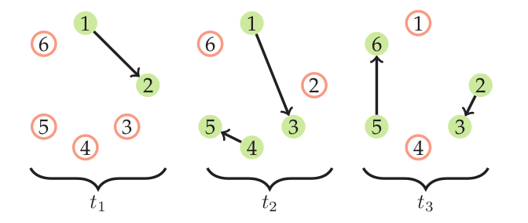

# EvolvingGraphs

[](https://travis-ci.org/EtymoIO/EvolvingGraphs.jl)
[](https://codecov.io/github/EtymoIO/EvolvingGraphs.jl?branch=master)

Dynamic Graph Analysis Framework in Julia.

* Installation: ``Pkg.add("EvolvingGraphs")``

* [Documentation](http://evolvinggraphsjl.readthedocs.org/en/latest/)

* [Release Notes](https://github.com/weijianzhang/EvolvingGraphs.jl/blob/master/NEWS.md)


* New Documenation (testing): https://etymoio.github.io/EvolvingGraphs.jl/latest

## Examples



We can generate the above evolving graph as

```julia
	julia> i = [1, 1, 4, 2, 5];
	julia> j = [2, 3, 5, 3, 6];
	julia> t = ["t1", "t2", "t2", "t3", "t3"];
	julia> g = evolving_graph(i,j,t)
```
Now ``g`` is a directed evolving graph with
6 nodes, 5 edges and 3 timestamps.

```julia
	julia> g
	Directed EvolvingGraph (6 nodes, 5 edges, 3 timestamps)
```

We can find the shortest temporal path of ``g`` by

```julia
	help?> shortest_temporal_path

      shortest_temporal_path(g, v1, t1, v2, t2 [, verbose = false])

	Find the shortest temporal path from node v1 at timestamp t1 to node v2 at
	timestamp t2 on the evolving graph g. If verbose = true, prints the current
	path at each search step.

	julia> shortest_temporal_path(g, 1, "t1", 3, "t3")
	(Node(1),"t1")->(Node(1),"t2")->(Node(3),"t2")->(Node(3),"t3")
```

We can also convert ``g`` to a list of adjacency matrices

```julia
	julia> matrix(g, "t2")
	6x6 Array{Float64,2}:
	0.0  0.0  1.0  0.0  0.0  0.0
	0.0  0.0  0.0  0.0  0.0  0.0
	0.0  0.0  0.0  0.0  0.0  0.0
	0.0  0.0  0.0  0.0  1.0  0.0
	0.0  0.0  0.0  0.0  0.0  0.0
	0.0  0.0  0.0  0.0  0.0  0.0

	julia> spmatrix(g, "t2")
	6x6 sparse matrix with 2 Float64 entries:
		[1, 3]  =  1.0
		[4, 5]  =  1.0
```

## References

- Weijian Zhang,
  "Dynamic Network Analysis in Julia",
  *MIMS EPrint*, 2015.83, (2015).
  [[pdf]](http://eprints.ma.man.ac.uk/2376/01/covered/MIMS_ep2015_83.pdf)

- Jiahao Chen and Weijian Zhang,
  "The Right Way to Search Evolving Graphs",
  *MIMS EPrint*, 2016.7, (2016)
  [[pdf]](http://eprints.ma.man.ac.uk/2445/01/covered/MIMS_ep2016_7.pdf)
  [[source]](https://github.com/jiahao/paper-evolving-graphs1)
