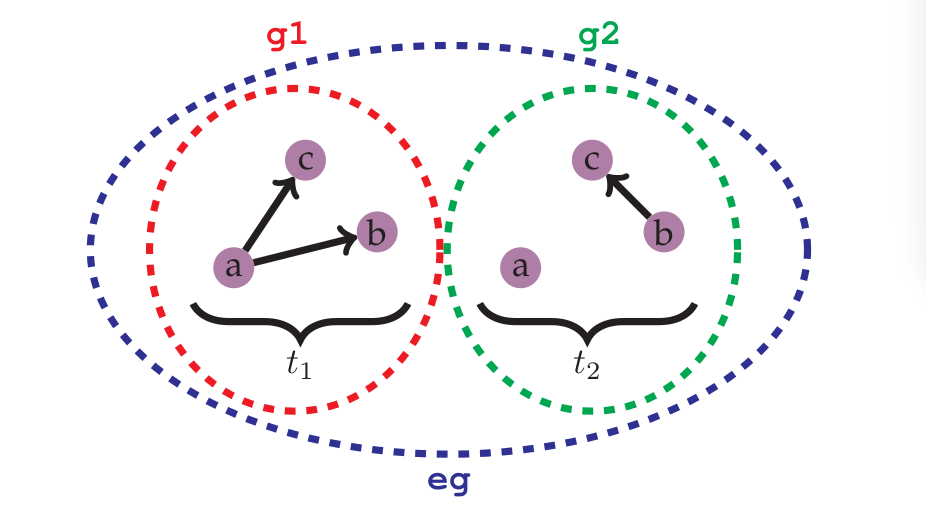
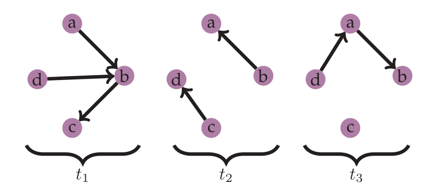

Getting Started
===============

To start using EvolvingGraphs, it should be imported into the local scope::
 
  julia> using EvolvingGraphs

Suppose we have an evolving network with 2 timestamps 
:math:`t_1, t_2` as shown in the figure below.

To represent this evolving graph, we first build two graphs at
time :math:`t_1` and :math:`t_2` with the function ``time_graph``::

  g1 = time_graph(Char, "t1")
  add_edge!(g1, 'a', 'b')
  add_edge!(g1, 'a', 'c')

  g2 = time_graph(Char, "t2")
  add_edge!(g2, 'b', 'c')

and then build an evolving graph ``eg`` by adding ``g1`` and ``g2``::

  eg = evolving_graph(Char, String)
  add_graph!(eg, g1)
  add_graph!(eg, g2)

Now ``eg`` is a directed evolving graph with 3 nodes, 3 edges and 2 
timestamps. We can retrieve information from ``eg``::

  julia> nodes(eg)
  3-element Array{Char,1}:
  'a'
  'b'
  'c'

  julia> edges(eg)
  3-element Array{EvolvingGraphs.TimeEdge{V,T},1}:
  TimeEdge(a->b) at time t1
  TimeEdge(a->c) at time t1
  TimeEdge(b->c) at time t2

  julia> timestamps(eg)
  2-element Array{AbstractString,1}:
  "t1"
  "t2"

Another way to generate the same evolving graph is to use the function 
``add_edge!``::

  eg2 = evolving_graph(Char, String)
  add_edge!(eg2, 'a', 'c', "t1")
  add_edge!(eg2, 'a', 'b', "t1")
  add_edge!(eg2, 'b', 'c', "t2")

In addition, we can generate an evolving graph by 3 vectors: ``i``, ``j`` and ``t`` 
such that ``i[k], j[k], t[k]`` represent an edge from ``i[k]`` to ``j[k]``
at time ``t[k]``. For example, the evolving graph in the following figure
can be generated as::
  
  i = ['a', 'd', 'b', 'b', 'c', 'd', 'a'];
  j = ['b', 'b', 'c', 'a', 'd', 'a', 'b'];
  t = ["t1", "t1", "t1", "t2", "t2", "t3", "t3"];
  eg = evolving_graph(i, j, t)

At each timestamp, ``eg`` can be represented as an adjacency matrix::
  
  julia> matrix(eg2, "t1")
  4x4 Array{Bool,2}:
  false  false   true  false
  false  false   true  false
  false  false  false   true
  false  false  false  false

where the :math:`(i,j)` entry is ``true`` if there is an edge from 
``nodes(eg2)[i]`` to ``nodes(eg2)[j]`` and ``false`` otherwise. Note::

  julia> nodes(eg2)
  4-element Array{Char,1}:
  'a'
  'd'
  'b'
  'c'

A sparse representation is also available::

  julia> spmatrix(eg2, "t2")
  4x4 sparse matrix with 2 Bool entries:
        [3, 1]  =  true
	[4, 2]  =  true
