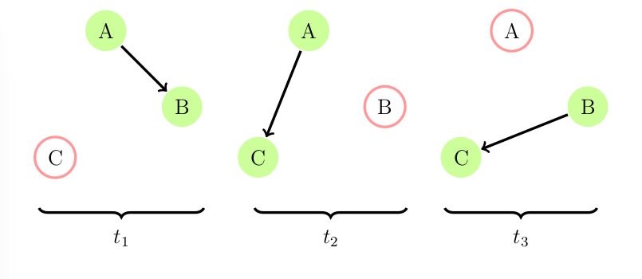

Overview
========

Introduction
-------------

We model an evolving graph as a sequence of static graphs
:math:`{G_1, G_2, \ldots, G_n }`, where :math:`G_t=(V(t), E(t))` is a
snapshot of the evolving graph at timestamp :math:`t`. :ref:`fig_eg3t`
shows an evolving graph with 3 timestamps. We say a node :math:`v` at
timestamp :math:`t`, denoted by :math:`(v,t)`, is *active* at timestamp
:math:`t` if it is connected to at least another node at timestamp
:math:`t`. For example, the nodes
:math:`(A,t_1),(B,t_1),(A,t_2),(C,t_2),(B,t_3),(C,t_3)` are active in
the evolving graph of :ref:`fig_eg3t`.

.. _fig_eg3t:
   

   Figure 1

We define the *temporal path* :math:`p((v_i,t_1), (v_j,t_n))` between
node :math:`v_i` at timestamp :math:`t_1` and node :math:`v_j` at
timestamp :math:`t_n` to be an ordered set of active nodes
:math:`(v_i,t_1), (v_{i+1}, t_2),\ldots, (v_j,t_n)` such that
:math:`t_1 \leq t_2 \leq \ldots \leq t_n` and 
:math:`((v_h,t_k),(v_{h+1}, t_{k+1})) \in E(t_k)` if :math:`t_k = t_{k+1}`, 
otherwise we have :math:`v_h = v_{h+1}`. A *shortest temporal path* is a 
temporal path with the least number of unique nodes. 

In **EvolvingGraphs**, we could do::

  julia> g = evolving_graph(Char, Int)
  Directed EvolvingGraph (0 nodes, 0 static edges, 0 timestamps)

  julia> add_edge!(g, 'A', 'B', 1)
  Node(A)->Node(B) at time 1

  julia> add_edge!(g, 'A', 'C', 2)
  Node(A)->Node(C) at time 2

  julia> add_edge!(g, 'B', 'C', 3)
  Node(B)->Node(C) at time 3

  julia> shortest_temporal_path(g, 'A', 1, 'C', 3)
  (Node(A),1)->(Node(A),2)->(Node(C),2)->(Node(C),3)

Definitions
--------------

  Evolving graphs
                    An evolving graph :math:`G_n` is a sequence of static graphs 
                    :math:`G_n=\langle G^{[1]}, G^{[2]}, \ldots G^{[n]} \rangle` with
	            associated time labels :math:`t_1, t_2, \ldots t_n` respectively.
		    Each :math:`G^{[t]} = (V^{[t]}, E^{[t]})` represents a static graph
		    labeled by a time :math:`t`.

  Temporal node
                    A temporal node is a pair :math:`(v,t)`, where :math:`v \in V^{[t]}` is 
		    a node at a time :math:`t`.

  Active node
                    A temporal node :math:`(v,t)` is an active node if there exists at least
		    one edge :math:`e \in E^{[t]}` that connects :math:`v \in V^{[t]}` to 
		    another node :math:`w \in V^{[t]}`, :math:`w \ne v`. An inactive node
		    is a temporal node that is node an active node.

		    
  Temporal path
                    A temporal path of length :math:`m` on an evolving graph :math:`G_n`
		    from temporal node :math:`(v_1, t_1)` to temporal node :math:`(v_m, t_m)`
		    is a time-ordered sequence of active nodes, 
		    :math:`\langle (v_1, t_1), (v_2, t_2), \ldots, (v_m, t_m) \rangle`. Here, 
	            time ordering means that :math:`t_1 \leq t_2 \leq \cdots \leq t_m` and
		    :math:`v_i = v_j` iff :math:`t_i \ne t_j`.

  Forward neighbor
                    The k-forward neighbors of a temporal node :math:`(v,t)` are the temporal
		    nodes that are the :math:`(k+1)` st temporal node in every temporal path
		    of length :math:`k+1` starting from :math:`(v,t)`. The forward neighbors of
		    a temporal node :math:`(v,t)` are its 1-forward neighbors.

  Reachable
                   A temporal node :math:`(w,s)` is reachable from a temporal node :math:`(v,t)`
		   if there exists some finite integer :math:`k` for which :math:`(w,s)` is a 
		   k-forward neighbor of :math:`(v,t)`.

