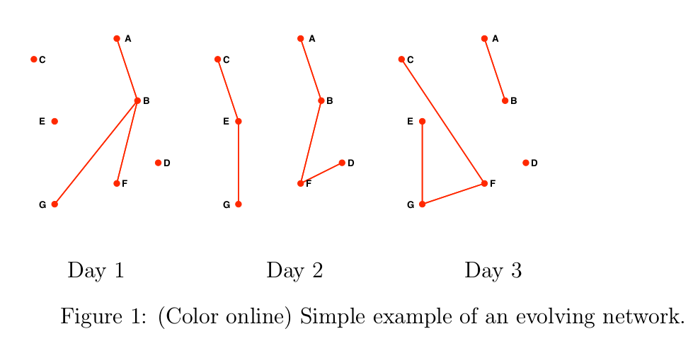

Tutorial
========

Working with Evolving Graphs
----------------------------

We can initialize a simple evolving graph with integer nodes and edges by::

  julia> g = evolving_graph()
  Directed EvolvingGraph (0 nodes, 0 edges, 0 timestamps)

There is nothing in the graph ``g`` at the moment. To make it a little 
more interesting, we can add some edges to ``g``. We need to note that
edges have a time dimension in an evolving graph::

  julia> add_edge!(g, 1, 2, 1)
  Node(1)->Node(2) at time 1

This will add an edge from node ``1`` to node ``2`` at time ``1``. 
Let's add more edges to ``g``::

  julia> add_edge!(g, 2, 3, 1)
  Node(2)->Node(3) at time 1

  julia> add_edge!(g, 2, 3, 2)
  Node(2)->Node(3) at time 2

  julia> add_edge!(g, 2, 4, 2)
  Node(2)->Node(4) at time 2

Now ``g`` has 4 nodes, 4 edges and 2 timestamps. Here are the edges we have::

  julia> edges(g)
  4-element Array{EvolvingGraphs.TimeEdge{EvolvingGraphs.Node{Int64},Int64},1}:
  Node(1)->Node(2) at time 1
  Node(2)->Node(3) at time 1
  Node(2)->Node(3) at time 2
  Node(2)->Node(4) at time 2

We can also check the edges at a specific timestamp::

  julia> edges(g, 2)
  2-element Array{EvolvingGraphs.TimeEdge{EvolvingGraphs.Node{Int64},Int64},1}:
  Node(2)->Node(3) at time 2
  Node(2)->Node(4) at time 2

We can think of an evolving graph as a list of adjacency matrices. 
In particular, at each timestamp ``g`` can be represented as an adjacency 
matrix::

  julia> matrix(g, 1)
  4x4 Array{Float64,2}:
  0.0  1.0  0.0  0.0
  0.0  0.0  1.0  0.0
  0.0  0.0  0.0  0.0
  0.0  0.0  0.0  0.0

  julia> matrix(g, 2)
  4x4 Array{Float64,2}:
  0.0  0.0  0.0  0.0
  0.0  0.0  1.0  1.0
  0.0  0.0  0.0  0.0
  0.0  0.0  0.0  0.0

where the ``(i,j)`` entry is ``1.0`` if there is an edge from
the ``i`` th node to the ``j`` th node and ``0.0`` otherwise.  An
interesting fact is a degree 2 dynamic walk can be found by multiplying 
the two adjacency matrices::

  julia> matrix(g, 1)* matrix(g, 2)
  4x4 Array{Float64,2}:
  0.0  0.0  1.0  1.0
  0.0  0.0  0.0  0.0
  0.0  0.0  0.0  0.0
  0.0  0.0  0.0  0.0

This shows there are two degree 2 dynamic walks: from node ``1`` to node ``3`` 
(via node ``2``) and from node ``1`` to node ``4`` (via node ``2``). 
   

Inputting Data 
--------------

There is a sample dataset at the directory ``data/``: 

* ``manunited_cont.csv`` is the Strathclyde MUFC Twitter Data Set.

More details of the datasets can be found at: https://github.com/weijianzhang/EvolvingGraphDatasets

We can input them with the function ``egread``::

  julia> twitterdata = joinpath(Pkg.dir("EvolvingGraphs"), "data", "manunited_cont.csv");
  julia> twitter = egread(twitterdata)
  Directed EvolvingGraph (148918 nodes, 298335 edges, 37581 timestamps)

Analyzing Evolving Graphs
-------------------------

The evolving graph shown below comes from the paper by Grindrod et
al. [grindrod11]_. 

It can be created in EvolvingGraphs as::
  
  g = evolving_graph(Char, Int, is_directed = false)
  add_edge!(g, 'a', 'b', 1)
  add_edge!(g, 'b', 'g', 1)
  add_edge!(g, 'b', 'f', 1)
  add_edge!(g, 'c', 'e', 2)
  add_edge!(g, 'e', 'g', 2)
  add_edge!(g, 'a', 'b', 2)
  add_edge!(g, 'b', 'f', 2)
  add_edge!(g, 'f', 'd', 2)
  add_edge!(g, 'a', 'b', 3)
  add_edge!(g, 'c', 'f', 3)
  add_edge!(g, 'e', 'g', 3)
  add_edge!(g, 'g', 'f', 3)
  
Now ``g`` is an evolving graph with 7 nodes, 24 edges and 3 timestamps::

  julia> g
  Undirected EvolvingGraph (7 nodes, 24 edges, 3 timestamps)

We may choose to represent the nodes of this graph as people and the edges
as phone calls. Then for example, we notice ``a`` talked to ``b`` at
timestamp ``1`` and ``g`` talked to ``f`` at timestamp ``3``.  One
interesting question is: can ``a`` pass a message to ``e``?
The answer is yes, since ``a`` can talk to ``b`` and ``b`` can talk to
``g`` in day ``1`` and ``g`` can talk to ``e`` on day ``2``. This can
be computed using ``shortest_temporal_path`` ::

  julia> shortest_temporal_path(g, 'a', 1, 'e', 2)
  (Node(a),1)->(Node(b),1)->(Node(g),1)->(Node(g),2)->(Node(e),2)

and the shortest distance of passing this message is ``4``::

  julia> shortest_temporal_distance(g, 'a', 1, 'e', 2)
  4

.. [grindrod11] P. Grindrod, M, Parsons, D.J. Higham, and E. Estrada, 
	      "Communicability across evolving networks", *Physcial Review E*,
	      83(4). 046120 (2011).
