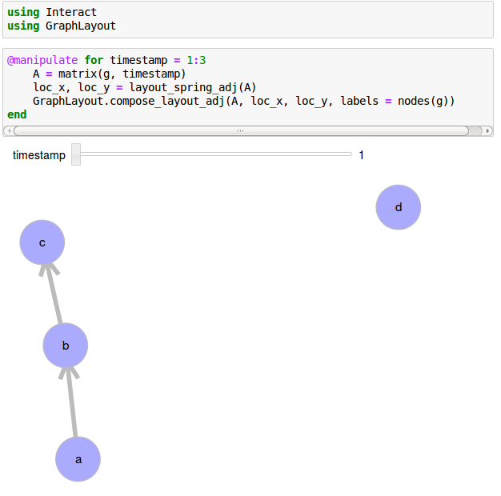

Plotting
==========

``Interact.jl`` and ``GraphLayout.jl`` allow us to visualize an evolving graph.

Example
-----------

For a simple evolving graph ``g`` defined as::

  g = evolving_graph(Char, Int)
  add_edge!(g, 'a', 'b', 1)
  add_edge!(g, 'b', 'c', 1)
  add_edge!(g, 'b', 'c', 2)
  add_edge!(g, 'b', 'd', 2)
  add_edge!(g, 'a', 'c', 3)

We can visualize it on an IJulia notebook as

