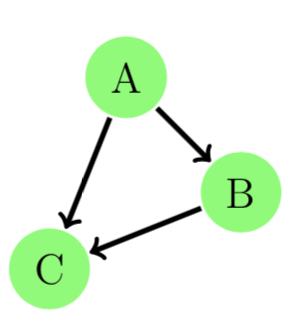

# Tutorial

## Why Evolving Graphs?

Many real-world networks store the relationship between entities with time stamps. Consider a group of online users interacting through messaging. Each message sent from user `v_i` to user `v_j` at time stamp `t_i` can be represented as an edge from node `v_i` to node `v_j` at `t_i`. It is natural to represent the user interaction network as an ordered sequence of networks, each has a time stamp label.
Ignoring the time stamps in the network can give wrong information.

Let's see a toy example. We let `A`, `B`, `C` be three co-workers working in the same internet company. There was a new assignment for `A`, `B`, and `C`.

If `A` first found out the assignment and told `B` on day `1` and `C` on day `2`. `B` reminded `C` about the assignment on day `3`.
Now everyone knew about this new assignment. This process is illustrated in the figure below.


We can model this example using an evolving graph. In EvolvingGraphs.jl,

```
julia> using EvolvingGraphs

julia> g = EvolvingGraph{Node{String}, Int}()
Directed EvolvingGraph 0 nodes, 0 static edges, 0 timestamps

julia> add_bunch_of_edges!(g, [("A", "B", 1), ("A", "C", 2), ("B", "C", 3)])
Directed EvolvingGraph 3 nodes, 3 static edges, 3 timestamps

julia> edges(g)
3-element Array{EvolvingGraphs.WeightedTimeEdge{EvolvingGraphs.Node{String},Int64,Float64},1}:
 Node(A)-1.0->Node(B) at time 1
 Node(A)-1.0->Node(C) at time 2
 Node(B)-1.0->Node(C) at time 3
```

It is clear that `A` is the most important person for passing this information. We use a generalised Katz centrality to evaluate the importance of `A`, `B`, and `C`.

```
julia> using EvolvingGraphs.Centrality

julia> katz(g)
3-element Array{Tuple{EvolvingGraphs.Node{String},Float64},1}:
 (Node(A), 0.698297)
 (Node(B), 0.567367)
 (Node(C), 0.436436)
```

Suppose our `A` was a keen person and decided to remind `B` again in day `2`. Now the networks look like


In EvolvingGraphs.jl, we add a new edge at timestamp `2`.

```
julia> add_edge!(g, "A", "B", 2)
Node(A)-1.0->Node(B) at time 2

julia> katz(g)
3-element Array{Tuple{EvolvingGraphs.Node{String},Float64},1}:
 (Node(A), 0.84485)
 (Node(B), 0.424056)
 (Node(C), 0.326197)
```

Notice that the rating of `A` is getting even higher than before.

If we just aggregate an evolving graph to a simple directed graph by ignoring the timestamps, they aggregate to form the same static graph and therefore
the ratings stay the same.



Evolving graphs provide richer information and allow us to have a detailed understanding of a real-world problem.


## Graph Traversal

How do we traverse an evolving graph? In a breadth-first search (BFS) one
first visits all the outward neighbors of the starting node, then visits all the outward neighbors of each of those nodes, and so on.

Let's look at the implementation of BFS in EvolvingGraphs.jl.

```
function breadth_first_impl(g, v)
    level = Dict(v => 0)
    i = 1
    fronter = [v]
    while length(fronter) > 0
        next = []
        for u in fronter
            for v in forward_neighbors(g, u)
                if !(v in keys(level))
                    level[v] = i
                    push!(next, v)
                end
            end
        end
        fronter = next
        i += 1
    end
    level
end
```

It looks exactly the same as a BFS in static graphs except here we use `forward_neigbors` not outward neighbors. `forward_neigbors` preserves the direction of time and make sure we do not travel back in time.


## A List of Adjacency Matrices

Researchers often consider an evolving graph as an ordered sequence of adjacency matrices `A^{k}`. In EvolvingGraphs.jl, we provide a data structure called `MatrixList`, which stores a list of adjacency matrices.

You can convert an evolving graph to an `MatrixList`

```
julia> using EvolvingGraphs

julia> g = EvolvingGraph()
Directed EvolvingGraph 0 nodes, 0 static edges, 0 timestamps

julia> add_bunch_of_edges!(g, [(1,2,2001),(2,3,2002),(3,4,2002),(1,4,2002),(2,3,2003),(2,5,2005)])
Directed EvolvingGraph 5 nodes, 6 static edges, 4 timestamps

julia> ml = evolving_graph_to_matrices(g)
MatrixList (4 matrices)
```

and can write a `for` loop to access its elements.

```
julia> for (i,m) in enumerate(ml)
        println("Matrix $i")
        println(m)
       end
Matrix 1

  [1, 2]  =  1.0
Matrix 2

  [2, 3]  =  1.0
  [1, 4]  =  1.0
  [3, 4]  =  1.0
Matrix 3

  [2, 3]  =  1.0
Matrix 4

  [2, 5]  =  1.0
```
